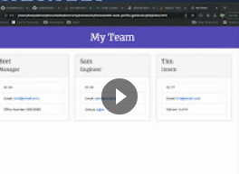

# team-profile-generator

Homework assignment #8 - Team profile generator

## what did I do?

This assignment included making a node application (with Inquirer) that will assist the user in building a team profile page for their own team. The user is presented with questions to gather information about their Managers, Engineers, and Interns. Once all of the information is gathered, an 'index.html' is generated and placed in the 'dist' folder.

The assignment also entailed running tests using Jest. I set up a test for each class that we were tasked with making. Each test tests slightly different parts of the class code for each class. With some tests I am testing the class's ability to be generated. Other tests I am testing the object being created with the supplied information. I also added a test to see that overridden values, specific to some classes, were returning the correct override information.

## what do I need to explain

When the user is done adding employees, an 'index.html' is generated and placed in the 'dist' folder.

In order to run a test, the user just run 'npm test' in the root directory of the project.

## video walk through of final product

