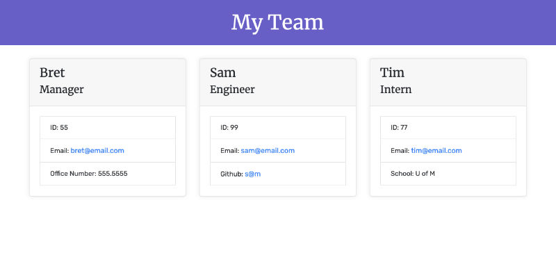

<div id="top"></div>
<!-- PROJECT SHIELDS -->
<!--
*** https://www.markdownguide.org/basic-syntax/#reference-style-links
-->
<!--
[![Contributors][contributors-shield]][contributors-url]
[![Forks][forks-shield]][forks-url]
[![Stargazers][stars-shield]][stars-url]
[![Issues][issues-shield]][issues-url]
[![MIT License][license-shield]][license-url]
[![LinkedIn][linkedin-shield]][linkedin-url]
-->

<!--

-->

<!---->

<!--
-->

 


<!-- PROJECT LOGO -->
<br />
<div align="center">
  <!--
  <a href="https://github.com/github_username/repo_name">
    
  </a>
  -->

<h2 align="center">Team Profile Generator</h2>
  <p align="center">
    This project involved making a node application (with Inquirer) that will assist the user in building a team profile page for their own team.
    <br />
    <br />
    <!--<a href="https://bretpeters3n.github.io/Advanced-CSS-Portfolio/">View Demo</a>-->
  </p>
</div>


<!--
Here's a blank template to get started: To avoid retyping too much info. Do a search and replace with your text editor for the following: `github_username`, `repo_name`, `twitter_handle`, `linkedin_username`, `email`, `email_client`, `project_title`, `project_description`
-->


<!-- TABLE OF CONTENTS -->
<details>
  <summary>Table of Contents</summary>
  <ul>
    <li>
      <a href="#overview">Overview</a>
      <ul>
        <li><a href="#built-with">Built With</a></li>
      </ul>
    </li>
    <li>
      <a href="#getting-started">Getting Started</a>
      <ul>
        <li><a href="#prerequisites">Prerequisites</a></li>
        <li><a href="#installation">Installation</a></li>
      </ul>
    </li>
    <li><a href="#authors">Authors</a></li>
    <li><a href="#preview">Preview</a></li>
    <li><a href="#demo">Demo</a></li>
    <li><a href="#testing">Testing</a></li>
    <li><a href="#contributing">Contributing</a></li>
    <li><a href="#license">License</a></li>
    <li><a href="#contact">Contact</a></li>
    <li><a href="#acknowledgments">Acknowledgments</a></li>
  </ul>
</details>


<!-- OVERVIEW -->
## Overview
This project included making a node application (with Inquirer) that will assist the user in building a team profile page for their own team. The user is presented with questions to gather information about their Managers, Engineers, and Interns. Once all of the information is gathered, an 'index.html' is generated and placed in the 'dist' folder.

The project also entailed running tests using Jest. A test is set up for each class that was used in the project. Each test tests slightly different parts of the class code for each class. Some tests test the class's ability to be generated. Other tests test the object being created with the supplied information. There is also testing to see that overridden values, specific to some classes, were returning the correct override information.

When the user is done adding employees, an 'index.html' is generated and placed in the 'dist' folder. This HTML file is a visual representation of the team that was just created.


<!-- BUILT WITH -->
### Built With
<!--* HTML
* CSS-->
* Javascript
* [NodeJS](https://nodejs.org/en/)
<!--* [jQuery](https://jquery.com/)
* [Bootstrap](https://getbootstrap.com/)-->

<p align="right">(<a href="#top">back to top</a>)</p>


<!-- AUTHORS -->
## Authors
- Bret Petersen: [bretpeters3n](https://github.com/bretpeters3n)

<p align="right">(<a href="#top">back to top</a>)</p>


<!-- PREVIEW -->
## Preview


<p align="right">(<a href="#top">back to top</a>)</p>


<!-- DEMO -->
## Demo
N/A
<!--[View Demo](https://bretpeters3n.github.io/Advanced-CSS-Portfolio/)-->

<p align="right">(<a href="#top">back to top</a>)</p>


<!-- GETTING STARTED -->
## Getting Started
These are instructions on setting up this project locally on your machine. To get a local copy up and running follow these simple example steps.


### Prerequisites
Make sure you have the latest installation of NPM (Node Package Manager) by following this step.
* Install/update NPM
   ```sh
   npm install npm@latest -g
   ```


### Installation
1. Clone the repo
   ```sh
   git clone https://github.com/bretpeters3n/team-profile-generator.git
   ```
2. Install NPM packages
   ```sh
   npm install
   ```
3. Run project
   ```sh
   node index.js
   ```

<p align="right">(<a href="#top">back to top</a>)</p>


## Testing
In order to run a test, use Terminal to run 'npm test' in the root directory of the project. See <a href="#overview">Overview</a> section for more testing details.
   ```sh
   npm test
   ```

<p align="right">(<a href="#top">back to top</a>)</p>


<!-- CONTRIBUTING -->
## Contributing

Contributions are what make the open source community such an amazing place to learn, inspire, and create. Any contributions you make are **greatly appreciated**.

If you have a suggestion that would make this better, please fork the repo and create a pull request. You can also simply open an issue with the tag "enhancement".
Don't forget to give the project a star! Thanks again!

1. Fork the Project
2. Create your Feature Branch (`git checkout -b feature/YourAmazingFeature`)
3. Commit your Changes (`git commit -m 'Add some YourAmazingFeature'`)
4. Push to the Branch (`git push origin feature/YourAmazingFeature`)
5. Open a Pull Request

<p align="right">(<a href="#top">back to top</a>)</p>


<!-- LICENSE -->
## License
Distributed under the MIT License. See `LICENSE` for more information.

<p align="right">(<a href="#top">back to top</a>)</p>


<!-- QUESTIONS -->
## Contact
Need a contact or have questions about this project? Please review the GitHub repo at [Team Profile Generator](https://github.com/bretpeters3n/team-profile-generator) or contact one of the authors on Github.

<p align="right">(<a href="#top">back to top</a>)</p>


<!-- ACKNOWLEDGMENTS -->
## Acknowledgments

* [Inquirer](https://www.npmjs.com/package/inquirer)


<p align="right">(<a href="#top">back to top</a>)</p>